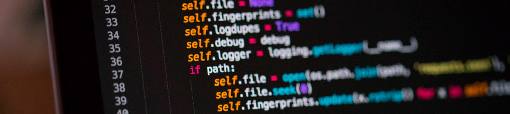

### Hi!, my name is Diego, i'm Software Developer 👋

- 🔭 I am currently working independently
- 👯 I’m Bach. Software Engineering and Programmer Analyst with more than 6 years of experience in the implementation of digital solutions (web and mobile platforms), for companies and enterprises using Agile frameworks.
- ⚡ SKILLS: PHP, Python, Javascript, Typescript, Databases.

  - Frontend:  

  - Backend:  

  - Database:  

  - Mobile:  

- 👯 I’m looking to collaborate on open source projects

<!--
**DiegoJS/DiegoJS** is a ✨ _special_ ✨ repository because its `README.md` (this file) appears on your GitHub profile.

Here are some ideas to get you started:

- 🌱 I’m currently learning ...
- 👯 I’m looking to collaborate on ...
- 🤔 I’m looking for help with ...
- 💬 Ask me about ...
- 📫 How to reach me: ...
- 😄 Pronouns: ...
- ⚡ Fun fact: ...
-->

 

- 😄Thank you for your visit

